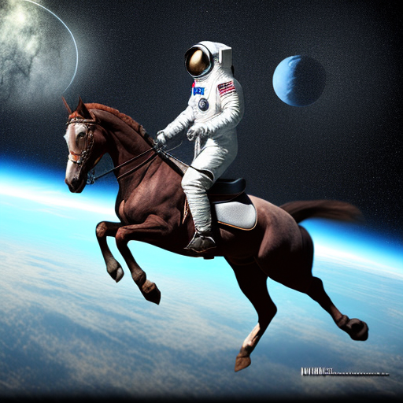

The `min_diffusion` library
================

<!-- WARNING: THIS FILE WAS AUTOGENERATED! DO NOT EDIT! -->

This library was put together for a series of experiments on
Classifier-free Guidance.

## Install

``` sh
pip install min_diffusion
```

## How to use `min_diffusion`

The library has a single main class
[`MinimalDiffusion`](https://enzokro.github.io/min_diffusion/core.html#minimaldiffusion).

This class takes three arguments:

- `model_name`  
- `device`  
- `dtype`

`model_name` is the string model name on the HuggingFace hub.  
`device` sets the hardware to run on.  
`dtype` is the `torch.dtype` precision for the torch modules.

``` python
# import the library
from min_diffusion.core import MinimalDiffusion
```

### Loading a sample model

Below is an example to load the
[openjourney](https://huggingface.co/prompthero/openjourney) model from
[PromptHero](https://prompthero.com/search?q=sauron&model=).

The model will be loaded in `torch.float16` precision and placed on the
GPU.

``` python
# set the model to load and its options
model_name = 'prompthero/openjourney'
device     = 'cuda'
dtype      = torch.float32
revision   = "fp32"
```

Creating a
[`MinimalDiffusion`](https://enzokro.github.io/min_diffusion/core.html#minimaldiffusion)
with these arguments:

``` python
# create the minimal diffusion pipeline
pipeline = MinimalDiffusion(model_name, device, dtype, revision)
```

Loading the pipeline:

``` python
# load the pipeline
pipeline.load();
```

    Enabling default unet attention slicing.

### Generating an image

Below is an example text prompt for image generation.

> Note the keyword `"mdjrny-v4 style"` at the start of the prompt. This
> is how the `openjourney` model creates images in the style of
> Midjourney v4.

``` python
# text prompt for image generations
prompt = "mdjrny-v4 style a photograph of an astronaut riding a horse"
```

#### Calling [`MinimalDiffusion`](https://enzokro.github.io/min_diffusion/core.html#minimaldiffusion) on the input text prompt

``` python
# generate the image
img = pipeline.generate(prompt);
```

    Using the default Classifier-free Guidance.

      0%|          | 0/50 [00:00<?, ?it/s]

Here is the generated image:

``` python
# view the output image
img
```



## Notes:

The pipeline assumes you have logged in to the HuggingFace hub.
